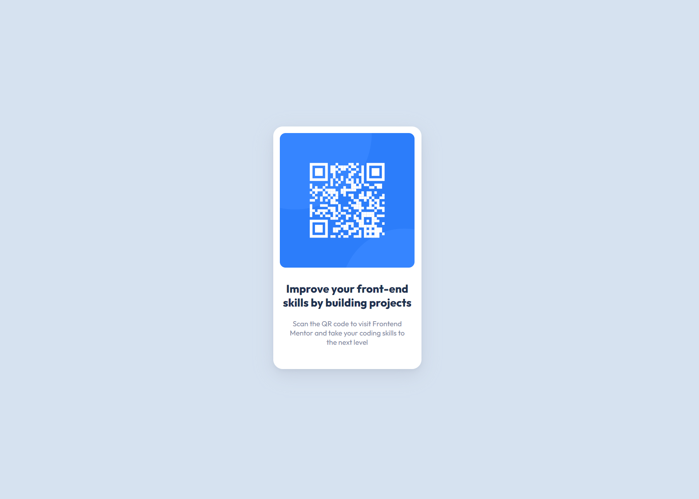

# Frontend Mentor - QR code component solution

This is a solution to the [QR code component challenge on Frontend Mentor](https://www.frontendmentor.io/challenges/qr-code-component-iux_sIO_H). Frontend Mentor challenges help you improve your coding skills by building realistic projects. 

## Table of contents

  - [Screenshot](#screenshot)
  - [Links](#links)
  - [Built with](#built-with)
  - [What I learned](#what-i-learned)
- [Author](#author) 

### Screenshot

### Links

https://nachtwurst.github.io/QR_code_component/

### Built with

- HTML5
- CSS
- Flexbox

### What I learned

I learned a lot from this exercise, since I started with basically zero knowledge of HTML and CSS. I learned how to import fonts, how to position things on the screen, how to use box-shadows, how to round the corners of elements, and, most importantly, how to use Flexbox. I also learned how to use max-width to allow elements to resize to fit nicely on mobile.

## Author

- Frontend Mentor - [@nachtwurst](https://www.frontendmentor.io/profile/nachtwurst)

